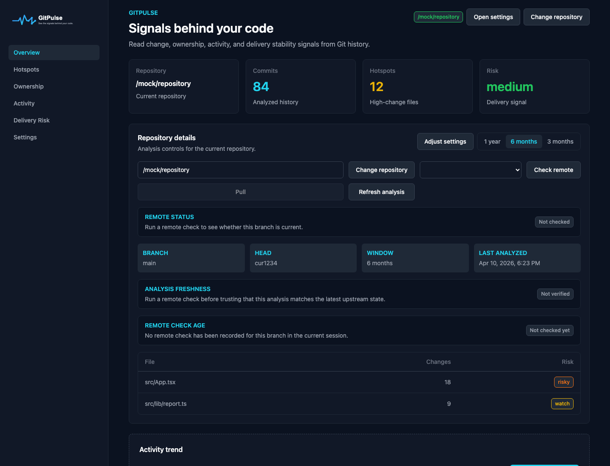
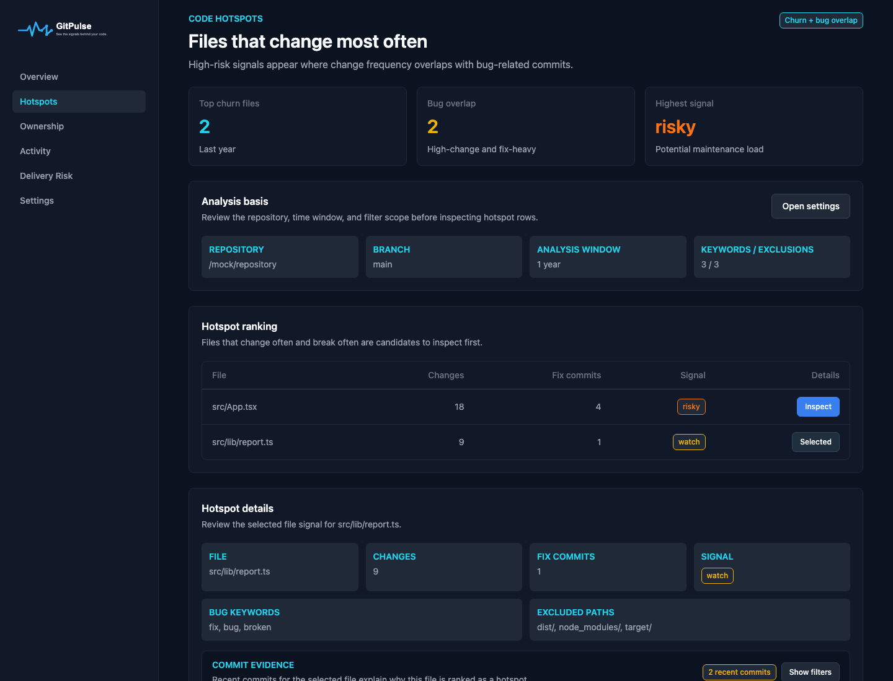
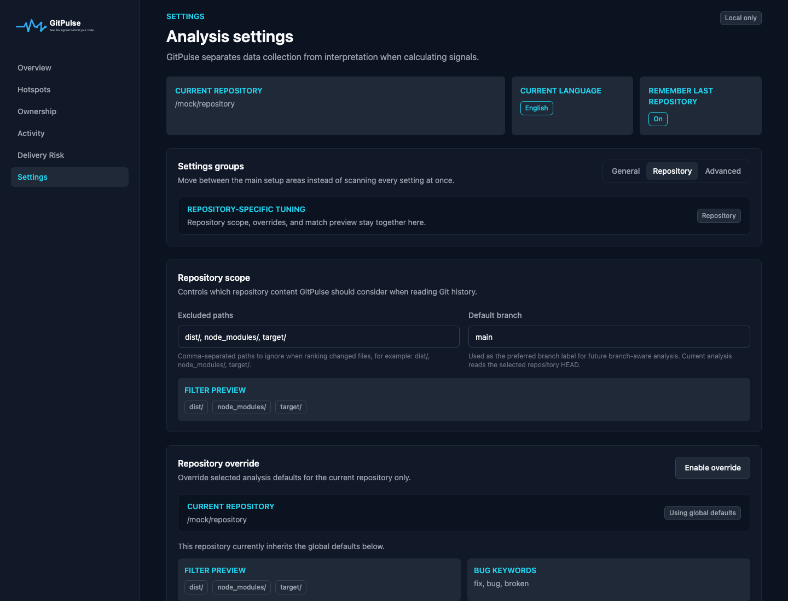

<p align="center">
  <picture>
    <source media="(prefers-color-scheme: dark)" srcset="icons/gitpulse_logo_dark.svg">
    <source media="(prefers-color-scheme: light)" srcset="icons/gitpulse_logo_light.svg">
    
  </picture>
</p>

<p align="center"><strong>Read repository signals from Git history.</strong></p>

<p align="center">
  GitPulse is a local-first desktop app for understanding code churn, ownership concentration,
  activity flow, and delivery pressure from an existing Git repository.
</p>

## Screenshots

### Overview



### Hotspots



### Settings



## What GitPulse does

GitPulse is not a Git GUI for commits and pushes.

It focuses on questions like:

- Which files change the most?
- Which hotspots overlap with bug-fix activity?
- How concentrated is ownership?
- Is team activity accelerating or thinning out?
- How often does the repository show hotfix, revert, or rollback pressure?
- Is the current analysis stale relative to the remote branch?

## Current feature set

### Overview

- Repository picker and branch switcher
- Remote status check and pull flow
- Analysis freshness and stale warning
- Snapshot history and baseline compare
- Markdown and JSON report export

### Hotspots

- Hotspot ranking by churn and fix overlap
- Commit evidence for each selected file
- Commit evidence filters for keyword matches, author, and search

### Ownership

- Contributor distribution by commit share
- Knowledge concentration signal
- On-demand contributor detail panel

### Activity

- Commit trend by analysis window
- Monthly activity table and chart

### Delivery Risk

- Emergency pattern analysis from configured keywords
- Risk table with explicit row inspection
- On-demand pattern detail panel

### Settings

- English / Korean UI
- Signal defaults for analysis window, bug keywords, and emergency patterns
- Repository-specific overrides
- Match preview against real repository history
- Presets for web app, library, and monorepo repositories
- Local import / export for settings
- Developer mode for diagnostics

### Persistence and diagnostics

- Local JSON database for settings, history, and analysis cache
- Structured log file written from frontend and Tauri commands
- Error boundary with debug-oriented error page
- Reveal DB file and log file from the app

## Product principles

- Local-first: GitPulse analyzes local repositories and stores local state on the machine.
- Signal-oriented: it shows evidence and concentration, not absolute judgments.
- Inspectable: risky rows can be traced back to the commits and patterns behind them.
- Progressive disclosure: the default view favors the current repository state over secondary controls.

## Tech stack

- Desktop shell: Tauri 2
- Frontend: React 18 + TypeScript + Vite
- State and data: Zustand + TanStack Query
- i18n: react-i18next
- Styling: Tailwind CSS + GitPulse semantic design tokens
- Backend analysis: Rust + Git CLI
- Local persistence: JSON file in the Tauri app data directory

## Project structure

```text
src/
  app/              App shell, providers, routing, global store
  components/       Reusable UI, chart, and layout components
  features/         Feature pages and feature-specific hooks
  i18n/             i18next config and locale files
  services/         Tauri bridge APIs and shared services
  styles.css        Semantic global classes

src-tauri/
  src/analysis/     Git history analysis builders
  src/commands/     Tauri command layer
  src/storage/      Local database and log storage
  tests/            Rust unit tests

docs/
  gitpulse_design_system.md
  gitpulse_feature_checklist.md
  ...
```

## Getting started

### Prerequisites

- Node.js 24+
- npm
- Rust stable
- Tauri system prerequisites for your OS

### Install

```bash
npm install
```

### Run the desktop app

```bash
npm run dev
```

### Run the frontend only

```bash
npm run dev:vite
```

### Production build

```bash
npm run build
```

## Quality checks

GitPulse keeps formatting, linting, build validation, frontend tests, and Rust tests under one command.

```bash
npm run check
```

Useful commands:

```bash
npm run format
npm run lint
npm run test:frontend
npm run test:rust
```

Rust aliases are defined in [.cargo/config.toml](.cargo/config.toml):

- `cargo gp-check`
- `cargo gp-lint`
- `cargo gp-test`

## Logging and local storage

GitPulse stores local app data under the Tauri app data directory.

- Database file: `gitpulse-db.json`
- Log file: `logs/gitpulse.log`

The app exposes actions in Settings to reveal both files directly.

Developer mode does not enable logging itself. Logging is always on. Developer mode only reveals more diagnostic detail in the UI.

## Open source workflow

Issues and pull requests are welcome.

When contributing:

1. Keep changes aligned with [docs/gitpulse_design_system.md](docs/gitpulse_design_system.md).
2. Prefer extending existing feature and component patterns over introducing a new UI style.
3. Add focused tests for behavior changes.
4. Run `npm run check` before opening a PR.

If you are changing repository analysis behavior, update both:

- frontend expectations and translations
- Rust analysis tests under `src-tauri/tests`

## Roadmap direction

The current app covers the core repository signal workflow. Likely next areas are:

- deeper commit and file drill-down
- richer snapshot comparison
- more repository presets
- export refinements
- stronger diagnostics and issue-report tooling

## License

GitPulse is licensed under the [Apache License 2.0](LICENSE).
